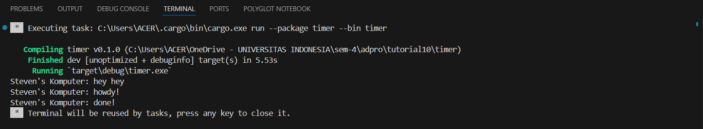
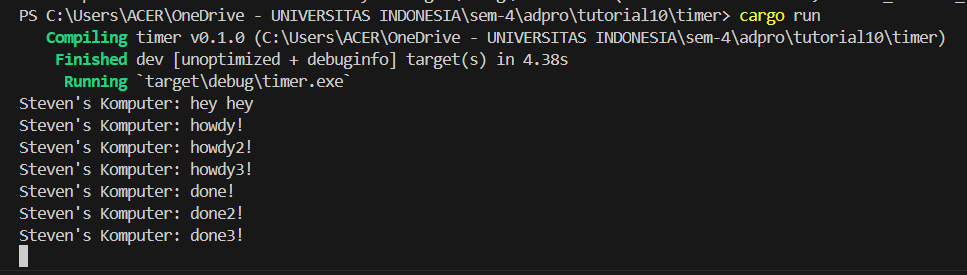

## 1.2 Understanding how it works

`Steven's Komputer: hey hey` came out first because it is ran outside the async function. The following 2 lines are priinted after the `hey hey` because they are inside the async function.

## 1.3 Multiple Spawn and removing drop

It can be seen from the output that `hey hey` still come out first, then followed by `howdy and done`. The first function will be run, which returns howdy. Then the second function will be run, which will return howdy2. At last, the third function will be run, which will return howdy3. Remember the program's sequence, where the function are run according to their order, from 1 to 3. Therefore, after howdy3, the program will give done, done2, and at last done3.